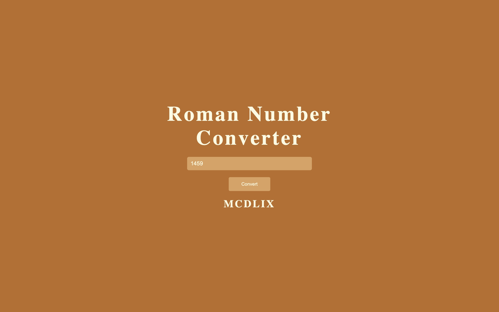

# Roman Numeral Converter

Program that convert Numbers into Roman Numbers.

## Screenshots

## Demo

[Link](https://thepageguy.github.io/roman_numeral_converter/)

## Author

- [@thepageguy](https://www.github.com/thepageguy)

## Acknowledgement

- [FreeCodeCamp](https://www.freecodecamp.org/)

## Tech Stack

**Languages:** HTML5, CSS3 and JavaSript

## Features

- Responsive
- From I to MMMCMXCIX

## Lessons Learned

- JS Array
- JS While Loops

## Feedback

If you have any feedback, please reach out at thepageguy@mailfence.com.
